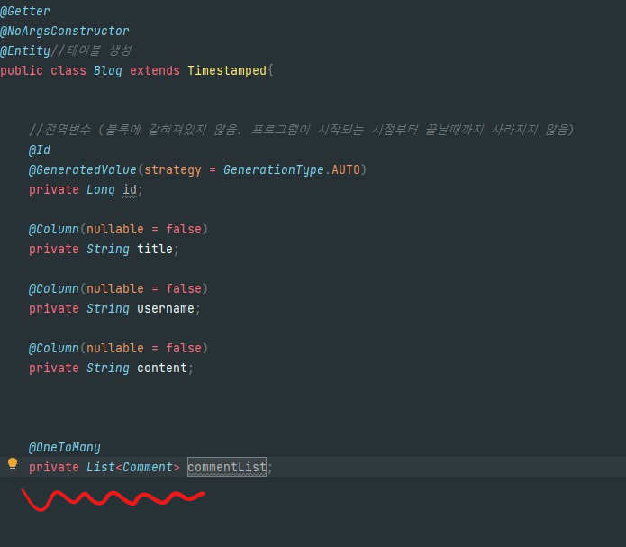

#스프링 심화 TIL

아 폭풍같은 한주가 다시 또 지나갔다. 이번 주차는 저번주차의 게시판 만들기에 기능을 덧붙히는 작업이였다.  
주 메인 기능은 SpringSecurity를 이용한 보안작업과 댓글을 구현하는 기능이였다.  
스프링 Security와 그리고 소셜 로그인 기능은 강의만 참고하여도 가능한 부분이라 큰 어려움은 없었다.  
일단 제일 어려웠던 댓글 기능에 대해 코드를 하나하나 해쳐보겠다.

제일 먼저 알아야할 개념

**JPA를 통한 엔티티의 연관관계 설정**  

이번 과제에서 테이블과의 연관관계에 대해서 한번 볼껀데,  
코드를 작성하기전에 지금 내가 필요한 테이블에 대해서 생각해보자
현재 가지고 있던 게시판 class  
그리고 댓글 class와 user class 총 3가지가 있다  

테이블간의 연관관계...  
하나의 블로그는 여러개의 댓글을 가지고 있을수 있다  
블로그를 중심으로 댓글을 생각해본다면  
1:다 의 관계가 성립이 된다  
one to many 관계인것임ㅋ 블로그가 기준이 되어 one 이고,  
블로그가댓글보다 더 큰 개념이기에 이렇게 된것 같다.

댓글은 1줄로 끝나는것이 아니니 List 자료형으로 들고오게 된다.

####CRUD 코드 해집어 보기
#CREAT

@PostMapping("/api/comments")
public void addComments(
@RequestBody CommentRequestDto requestDto,
@AuthenticationPrincipal UserDetailsImpl userDetails) {

        Long userId = userDetails.getUser().getId();
        commentService.creatComment(requestDto, userId);

    }

우리가 ajx를 통해서 받은 Json형태의 데이터들이  
("/api/comments") url로 "POST"형식의 요청이 들어 오게 되면
addComments라는 메소드가 실행 된다  
 - 여기서 내가 놓쳤던 부분 : url주소는 ajax 랑 100%일치 시켜줘야한다.
 - "/"제일앞 슬러시 부분을 빠트리고, api를 apl이라고 적는 바보같은 실수를 저질렀다.  

그러면 이제 변수로 CommentRequestDto를 **@RequestBody**를 통해 제이슨 형태의 파일을 
받고,  
로그인한 사용자의 정보를 파라미터로 받고 싶을때는 **@AuthenticationPrincipal**이것을 사용 한다!!
이렇게 가져온 userDetail의 아이디를 뽑아 Long userId라고 선언해주고, 
requestDto와 userId를 서비스에다가 함께 보내준다.
사실 컨트롤러에서 바로 Repository로 올릴수는 있지만, 서비스에서 기능을 분할해서 처리해준다.
이런 방식이 더 유지보수하기 쉬워질 것이다.  

자 이제 서비스 부분을 살펴보자

>public Comment creatComment(CommentRequestDto requestDto, Long userId) {  
// 받은 dto로 db에 넣을 객체 만들기  
 requestDto.setUserId(userId);  
Comment comment = new Comment (requestDto)
            commentRepository.save(comment);  
            Blog blog = blogRepository.findById(comment.getPostId()).orElse(null);;  
            blog.getCommentList().add(comment);  
            blogRepository.save(blog);    
            return comment;  
        }

컨트롤러에서 commentService.creatComment(requestDto, userId); 이부븐을 인텔리제이를 통하여   
바로 메소드를 만들어 주었다. 
이제 가져온 requestDto에다가 userId를 심어 줄것인데, 
내가 또 몰랐던 개념 Setter !
getter는 변수의 값을 가져올때 자주 썼지만, setter는 이제 변수의 값을 설정 해주는것인데
많이 써보지 못한것 같다. 

requestDto에다가 usdfId를 넣어 셋팅 해주고, requestDto를 넣은 Comment를 다시 생성한다.
여기서 생성된 comment를
commetRepository.save(comment)통해서 새로운 Entity를 레파지 토리에 save해준다  
여기서 느끼는 jpa의 편리함이다.
다음은

>            Blog blog = blogRepository.findById(comment.getPostId()).orElse(null);;

이 부분이 좀 이해하기 어려웠다.
여기가 이제 게시글에다가 댓글을 남겼을대 댓글이 가진 postId를 이용해서 해당 게시물을 가져오는  
찾아오고 가져오는 과정이다.   findById는 jpaRepository가 BlogRepo에서 extend되어져있기 때문에
따로 레파지토리에 메서드를 쓰지 않아도 실행이 가능하다. 
이제 comment의 해당 게시물을 찾아왔으니, 
blog.getCommentList().add(comment);를 통해서,  
blog에 우리가 이제 새로 심어 놓았던 List<Comment>commentList를 get으로 불러와서,  
add(comment) 새로운 우리가 쓴 코멘트를 추가해준다.

add된 blog는 Repo에 save시키고

return값은 comment로 반환한다. return 값?;;;

