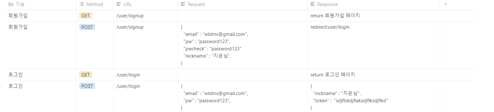
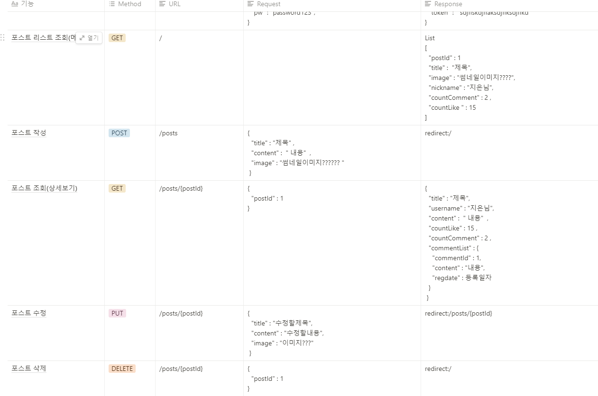
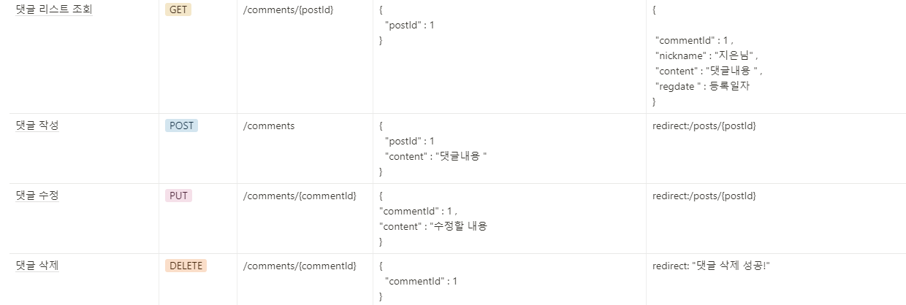
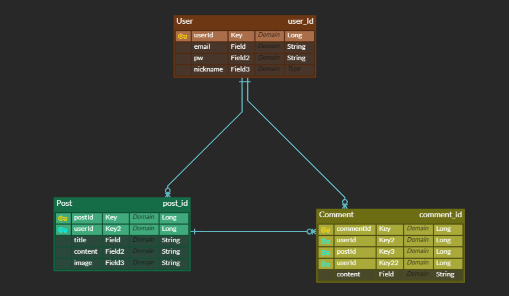

댓글 CRUD #1 댓글 테이블 설계하기 
================================

오늘 재환님께서 기능 설계 특강을 해주셨다.  

### 우리가 기능을 설계할때 가장 먼저 해야하는 일이 무엇일까?
정답은 테이블 Entity설계이다.
우리가 이번 Velog를 클론 코딩 하면서 ,
 설계한 테이블은 총 3가지가 있다.

1.User  
2.Post    
3.Comment  

#### 회원가입 API설계


#### POST API설계


#### COMMENT API설계



테이블간의 연관관계. ERD


테이블 간의 연관관계

1.User Table  
- user 한명을 기준으로 유저는 1개이상의 post를 가질 수 있다.
- User:Post = 1 : many
-이미지를 참고하자면, 저 문어발이 향하는 것이 'many'쪽이다.  자동으로 상대 테이블의 primarykey가 생기게 된다.
- Post에도 userId 키가 생겼으며, 이제 포스트는 userId만으로도 user의 모든 정보를 알수있게 되었다. !

자 그럼 Entity를 다시 짜보자 !
```java

@Entity
public class User{ //*부분은 빠트리거나, 잘못적은 부분
    @Id *@GeneratedValue(strategy = GenerationType.IDENTITY)
    private Long *userId;
    
    @Column(nullable = false, *unique = true)
    private String email;
    
    @Column(nullable = false)
    private String pw;//pwcheck까지 원래 Entity넣었었는데, 생각해보니 이거는 단순 중복 체크용인데, 따로 디비에 저장될 이유가 없었다.)~~
 
    @Column(nullable = false)
    private String nickname;
    
//    @OnetoMany
//    private Long postId;
 ***
    @OneToMany(mappedBy = "user", cascade = CascadeType.ALL)//한 유저가 가지는 포스트의 개수는 1개 이상이다.List ,
                                 // casacade :작은 폭포, 한꺼번에 많이 쏟아지는 것 위에서 아래로 내려오는것, 상위엔터티에서 하위엔터티로 모든 작업을 전파.
    @JsonBackReference // 순환 참조 방지
    private List<Post> postList;
 
 ***
    @OnetoMany(mappedBy = "user", cascade = CascadeType.ALL)
    @JsonBackReference
    private Long <Comment> commentList;
}
```

2.Post Table  
- 하나의 포스트는 여러개의 코맨트를 가질수 있다
- Post : Comment = 1 : many
```java
public class Post {    
    @Id @GeneratedValue(strategy = GenerationType.IDENTITY)
    private Long postId;
    @Column (nullable = false)
    private String title;
    @Column
    private String content;
    @Column
    private String image;
    
    @ManyToOne(fetch = FetchType.LAZY)
    @JoinColumn(name = "user_id")//RDS에서는 대문자를 안쓰고,,저렇게 언더바로 표시한다고 하셨나..
    private Long userId;
    
    @OnetoMany(mappedBy="user", cascade = cascadeType.ALL)
    @JsonBackReference
    private List<Comment> commentList;
}
```

(fetch = FetchType.LAZY) 이것은 지연로딩을 해달라는 말.
부모엔티티가 호출되어도 자식 테이블이 무조건 호출되어야 한다면, 이것은 낭비일 수 있다.  
A Entity(부모)를 조회할 때 지연로딩지정된 B Entity(자식를 즉시 로딩 하지 않고,  
실제 A.getB()로 B Entity를 호출할 때 datebase로 해당되는 B entity를 조회해 오는 방식

반대 -> 즉시 로딩 (FetchType.EAGER)  
A Entity(부모)를 조회할 때 즉시 로딩지정된 B Entity(자식)를 즉시 로딩하는 방식, A.getB()로 실제 B엔티티를 호출하지 않아도,  
DB로부터 해당 B Entity를 조회하여 A의 내용으로 포함하여 조회해오는 방식 .  


3.Comment Table  
- 댓글 하나는 게시글 에도 종속 되어있고, User에도 종속되어 있는 관계이다.
```java
@Id @GenteratedValue(strategy = GenerationType.IDENTITY)
private Long commentId;
@Column(nullable = false)
private String content; 

@ManytoOne(fetch = FetchTupe.LAZY)
@JsonManagedReference // @JsonBackReference와 비슷한 뉘앙스. 무한으로 순환되는걸 방지
@JoinColumn(name = "user_id")
private User user; //userId외래키 하나로 user 테이블을 모두 살펴볼 수 있음

@ManyToOne(new FetchType.LAZY)
@JsonManageReference
@JoinColumn (name = "post_id")
private Post post;
```

@JoinColumn을 쓸때 컬럼의 네임 방식을 postId라고 쓰지 않는다.  
스네이크 표기법(snake_case)를 써서 한 문자마다 _(underscore)를 붙여 이어나는 표기법이다.post_id 

자바에서 우리가 일반적으로 쓰는 것은 camelCase(카멜표기법)
첫 문자를 소문자로 표기하고, 그 다음부터는 대문자로 표기합니다.postId
