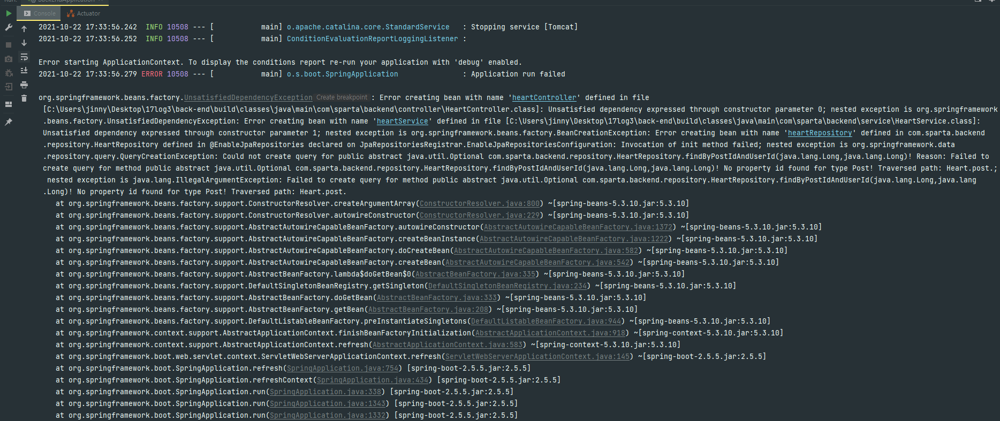
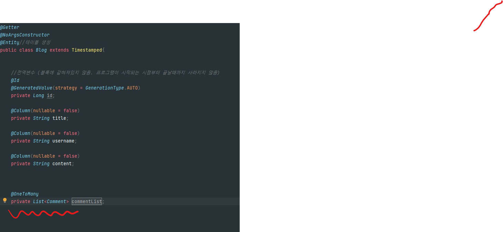

# 17log(velog clone coding) 프론트엔드


## 📰 상세 페이지


## 💻 웹 사이트

웹사이트 주소넣기

## 🎬 실행화면

유튜브 링크 : 유튜브 주소넣기

## ⚙️ 기술 스택 및 툴


## ✨ 17log 소개


## 🙋 팀원

- Front-end(React): 김다원, 박새봄, 배수인
- Back-end(Node.js): 송지은, 홍재환

## 🌎 API

API주소 넣기

## ⏳ 팀 프로젝트 기간

- 2021.10.18 ~ 2021.10.22(5일)

## ✨ 주요 기능

1. 로그인 & 회원가입


2. post


3. 댓글


# 해결하지 못한 오류 💔💦




좋아요 기능 구현중, 변수명으로 맞닥뜨린 오류
========================
 ```java
@NoArgsConstructor
@Getter
@Entity
public class Heart {

    @Id
    @GeneratedValue(strategy = GenerationType.IDENTITY)
    private Long id;

    @ManyToOne
    @JoinColumn(name="post_id")
    private Post post;

    @ManyToOne
    @JoinColumn(name = "user_id")
    private User user;

    public Heart(Post post, User user) {
        this.user = user;
        this.post = post;
    }
}

```
Heart의 테이블을 살펴보면,  Post와 User테이블을 다대일 연관관계를 맺고 있다.
좋아요를 누르게 되면 post의 id와 user의 id를 얻을 수 있는 구조를 가졌다.

Post 와 User 테이블은 각각 postId 와 userId를 외래키로 가졌다.

class User
```java
    @Id @GeneratedValue(strategy = GenerationType.IDENTITY)
    private Long userId;
```

class Post
```java
 @Id @GeneratedValue(strategy = GenerationType.IDENTITY)
    private Long postId;
```

개발은 순조롭게 진행 되었고..   


HeartService를 구현하는 과정에서 문제에 맞닥뜨렸다.    


```
@RequiredArgsConstructor
@Service
public class HeartService {

    private final PostRepository postRepository;
    private final HeartRepository heartRepository;
    private final UserRepository userRepository;
    
    @Transactional
    public boolean liked(Long postId, UserDetailsImpl userDetails){

        User user = userRepository.findById(userDetails.getUser().getUserId()).orElseThrow(
                () -> new IllegalArgumentException("유저가 존재하지 않습니다.")
        );

        Post post = postRepository.findById(postId).orElseThrow(
                () -> new IllegalArgumentException("게시글이 존재하지 않습니다.")
        );
        Heart heart =heartRepository.findByPostIdAndUserId(post.getPostId(), user.getUserId()).orElse(null);
        if(heart ==null) {
            heart =  heartRepository.save(new Heart(post, user));
            user.addHeart(heart);
            post.addHeart(heart);
            return true;
        }
        else {
            user.deleteHeart(heart);
            post.deleteHeart(heart);
            heartRepository.delete(heart);
            return false;
        }

    }

}
```

오류 캡쳐



        Heart heart =heartRepository.findByPostIdAndUserId(post.getPostId(), user.getUserId()).orElse(null);

findByPostIdAndUserId 날릴때 id가 원래 소문자에서 대문자가 되는 형식인데,,
태초부터 userId로 대문자로 되있어서 그런가...🤢   
계속 오류가 났다.

급하게 Post와 User entity의 @Id값을 모두 id로 바꾸니 해결이 되었다.

하지만 내가 이렇게 바꾼다 한들..   
이걸 배포로 넘겨주니 프론트 단에서도 변수명을 다 바꿔줘야는 another변수가 생겨 버렸고 이것은 이미 금요일 배포 해야 하는 당일이였다...ㅜㅜ

내가 postId와 userId값을 그대로 유지하면서, 쿼리메서드 findBy를 쓸 수는 없었을까?..
그랬다면 백단에서 기존 작업을 유지하고 프론트에 넘겨 줄수 있었을텐데,
배포 당일날 변수명을 다시 바꾸자고 하기에는 risk가 크다고 판단되어서 기능 구현을 하지 못했다.


